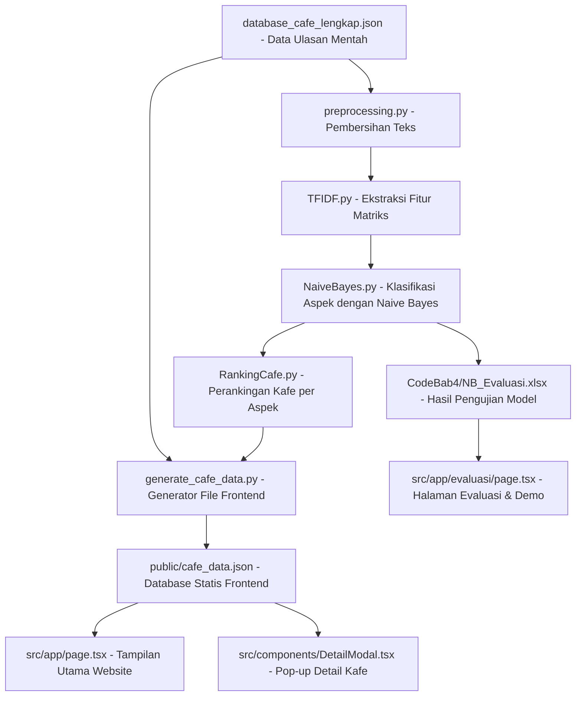

# Dokumentasi Arsitektur & Data Website Rekomendasi Kafe

Dokumen ini menjelaskan file-file yang berperan penting dalam aplikasi sistem rekomendasi kafe di Surabaya berbasis klasifikasi ulasan menggunakan algoritma **Naive Bayes** dengan pendekatan **Binary Relevance**.

---

## 1. File Acuan Data Utama Website (Source of Truth)

Website ini adalah aplikasi statis berbasis React/Next.js (Frontend) yang membaca file data terkompilasi agar rendering berjalan cepat tanpa latency database. Berikut adalah file acuan utama:

### 📂 `public/cafe_data.json` (Acuan Utama Data Kafe)
* **Peran**: File ini adalah **sumber data tunggal** yang dibaca oleh komponen frontend untuk menampilkan daftar kafe, detail koordinat/alamat, tautan gambar, data rating aspek, dan daftar ulasan pelanggan.
* **Bagaimana data ini dihasilkan?**: File ini dibuat dengan menjalankan script python [`generate_cafe_data.py`](file:///d:/Yongki/Joki/Yiyi/Final/Rekomendasi_Kafe/generate_cafe_data.py) yang menggabungkan:
  1. Hasil perankingan model Naive Bayes di file [`CodeBab4/Ranking_Kafe.xlsx`](file:///d:/Yongki/Joki/Yiyi/Final/Rekomendasi_Kafe/CodeBab4/Ranking_Kafe.xlsx).
  2. Data teks ulasan asli dari file [`database_cafe_lengkap.json`](file:///d:/Yongki/Joki/Yiyi/Final/Rekomendasi_Kafe/database_cafe_lengkap.json).

### 📂 `CodeBab4/NB_Evaluasi.xlsx` (Acuan Data Evaluasi)
* **Peran**: Sumber data nilai metrik evaluasi model (True Positive, True Negative, False Positive, False Negative, Akurasi, Presisi, Recall, dan F1-Score) untuk 4 aspek klasifikasi.
* **Penggunaan**: Di-render secara langsung pada halaman khusus evaluasi website (`/evaluasi`).

---

## 2. File-File Penting Frontend (Aplikasi Web)

Rangkaian file ini terletak di dalam folder `src/` dan mengontrol antarmuka pengguna (User Interface):

* **[`src/app/page.tsx`](file:///d:/Yongki/Joki/Yiyi/Final/Rekomendasi_Kafe/src/app/page.tsx) (Halaman Utama)**
  * Menampilkan header premium, spotlight kafe utama (*Fifteenth Café*), input search filter, serta baris horizontal (slider) rekomendasi kafe berdasarkan 4 aspek (Suasana, Harga, Pelayanan, Lainnya).
  * Di bagian kanan atas, terdapat tombol navigasi **"Evaluasi"** untuk mengakses halaman evaluasi.
* **[`src/app/evaluasi/page.tsx`](file:///d:/Yongki/Joki/Yiyi/Final/Rekomendasi_Kafe/src/app/evaluasi/page.tsx) (Halaman Evaluasi & Demo)**
  * Menampilkan visualisasi performa model klasifikasi berdasarkan data `NB_Evaluasi.xlsx`.
  * Di bagian bawah, terdapat modul **"Uji Coba Klasifikasi Aspek"** di mana pengguna dapat memasukkan teks ulasan uji coba secara interaktif untuk diklasifikasikan aspeknya secara langsung (real-time).
* **[`src/components/DetailModal.tsx`](file:///d:/Yongki/Joki/Yiyi/Final/Rekomendasi_Kafe/src/components/DetailModal.tsx) (Detail Kafe)**
  * Modal pop-up yang muncul ketika pengguna memilih suatu kafe. Menampilkan detail alamat, rating bintang per aspek (Suasana, Harga, Pelayanan, Lainnya), tombol tautan ke Google Maps, serta daftar ulasan yang difilter per aspek.
* **`src/app/globals.css` & `tailwind.config.ts` (Styling)**
  * Menyimpan sistem desain visual gelap (dark mode), palet warna premium (amber, emerald, blue, purple, orange), dan animasi transisi.

---

## 3. File-File Pemrosesan Data & Machine Learning (Python / Backend)

File-file di root dan folder `CodeBab4/` ini bertanggung jawab atas pemrosesan data latih/uji, ekstraksi fitur TF-IDF, training model Naive Bayes, dan penghitungan metrik evaluasi:

* **[`generate_cafe_data.py`](file:///d:/Yongki/Joki/Yiyi/Final/Rekomendasi_Kafe/generate_cafe_data.py)**
  * Script penghubung data backend ke frontend. Menghitung skor rating aspek (skala 1-5) berdasarkan kombinasi persentase ulasan positif, rata-rata probabilitas klasifikasi (*confidence*), serta posisi ranking hasil Naive Bayes.
* **[`CodeBab4/preprocessing.py`](file:///d:/Yongki/Joki/Yiyi/Final/Rekomendasi_Kafe/CodeBab4/preprocessing.py)**
  * Berfungsi membersihkan teks ulasan mentah (*text preprocessing*) melalui tahap: *Case Folding*, *Cleansing*, *Tokenizing*, *Stopword Removal*, dan *Stemming* (menggunakan library Sastrawi).
* **[`CodeBab4/TFIDF.py`](file:///d:/Yongki/Joki/Yiyi/Final/Rekomendasi_Kafe/CodeBab4/TFIDF.py)**
  * Menghitung bobot kata pada teks ulasan yang telah melalui preprocessing menggunakan metode TF-IDF (*Term Frequency - Inverse Document Frequency*) untuk membentuk matriks fitur.
* **[`CodeBab4/NaiveBayes.py`](file:///d:/Yongki/Joki/Yiyi/Final/Rekomendasi_Kafe/CodeBab4/NaiveBayes.py)**
  * Script inti machine learning. Mengimplementasikan algoritma **Multinomial Naive Bayes** dengan teknik **Binary Relevance** (melatih 4 model biner terpisah, masing-masing satu untuk aspek Pelayanan, Suasana, Harga, dan Others).
  * Melakukan pengujian model terhadap data test dan menghitung matriks evaluasi (TP, TN, FP, FN, Akurasi, Presisi, Recall, F1-Score).
* **[`CodeBab4/RankingCafe.py`](file:///d:/Yongki/Joki/Yiyi/Final/Rekomendasi_Kafe/CodeBab4/RankingCafe.py)**
  * Mengambil hasil klasifikasi ulasan dari model Naive Bayes, menghitung proporsi ulasan positif per kafe, dan menghasilkan daftar peringkat kafe untuk masing-masing aspek yang disimpan dalam `Ranking_Kafe.xlsx`.
* **[`CodeBab4/Visualisasi.py`](file:///d:/Yongki/Joki/Yiyi/Final/Rekomendasi_Kafe/CodeBab4/Visualisasi.py)**
  * Membuat grafik visualisasi performa model (seperti diagram perbandingan metrik evaluasi) dan gambar Wordcloud kata kunci ulasan.

---

## 4. Alur Kerja Data (Data Pipeline)

