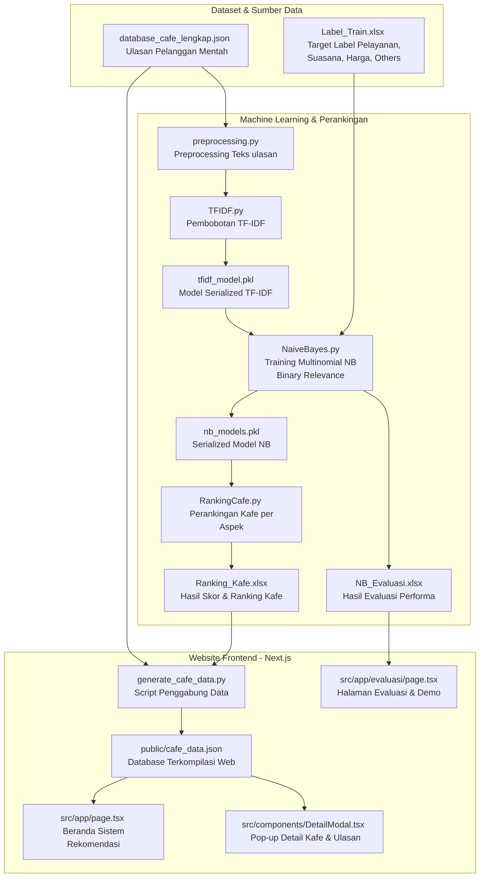

# Dokumentasi Detail Arsitektur & Alur Data Website Rekomendasi Kafe

Dokumen ini menjelaskan secara rinci tentang file-file yang membangun sistem informasi rekomendasi kafe di Surabaya, berlandaskan klasifikasi ulasan multi-label menggunakan algoritma **Multinomial Naive Bayes** dengan pendekatan **Binary Relevance**.

---

## 1. Alur Kerja Data & Pemrosesan (Flowchart)

Di bawah ini adalah diagram alur pemrosesan data, dari pengolahan teks ulasan mentah (*Machine Learning pipeline*) hingga data tersebut disajikan pada antarmuka website (*Frontend*):

---

## 2. Penjelasan Detail File Pemrosesan Data & Machine Learning (Backend)

Sistem ini menggunakan bahasa Python untuk bagian data preprocessing, training model klasifikasi ulasan, dan analisis hasil perankingan kafe.

### A. Preprocessing & Ekstraksi Fitur
* **[`CodeBab4/preprocessing.py`](file:///d:/Yongki/Joki/Yiyi/Final/Rekomendasi_Kafe/CodeBab4/preprocessing.py)**:
  Berfungsi untuk membersihkan teks ulasan pelanggan dari noise. Tahapan preprocessing meliputi:
  * **Case Folding**: Mengubah semua huruf menjadi huruf kecil.
  * **Cleansing**: Menghilangkan tanda baca, angka, karakter khusus, dan spasi ganda.
  * **Tokenizing**: Memecah kalimat menjadi token kata.
  * **Stopword Removal**: Menghapus kata umum yang tidak memiliki signifikansi arti (misal: 'yang', 'dan', 'di').
  * **Stemming**: Mengubah kata berimbuhan menjadi kata dasar menggunakan library Python `Sastrawi`.
* **[`CodeBab4/TFIDF.py`](file:///d:/Yongki/Joki/Yiyi/Final/Rekomendasi_Kafe/CodeBab4/TFIDF.py)**:
  Mengubah teks ulasan yang telah dibersihkan menjadi bentuk vektor angka menggunakan metode **TF-IDF** (*Term Frequency - Inverse Document Frequency*). Skrip ini membatasi jumlah fitur teratas (misalnya 5.000 kata unik) dan menyimpan model ekstraksi fitur ke dalam file binary **`tfidf_model.pkl`**.

### B. Pemodelan Klasifikasi & Pengujian
* **[`CodeBab4/NaiveBayes.py`](file:///d:/Yongki/Joki/Yiyi/Final/Rekomendasi_Kafe/CodeBab4/NaiveBayes.py)**:
  * Membaca matriks TF-IDF dan label training (`Label_Train.xlsx`).
  * Menggunakan **Multinomial Naive Bayes** dengan Laplace Smoothing ($\alpha=1.0$).
  * Menerapkan metode **Binary Relevance** untuk menangani multi-label (klasifikasi multi-aspek), dengan cara melatih 4 model klasifikasi biner secara independen untuk aspek: **Pelayanan**, **Suasana**, **Harga**, dan **Others** (aspek lainnya seperti kebersihan atau parkir).
  * Melakukan prediksi pada data test dan mengukur tingkat keberhasilan klasifikasi. Nilai pengujian (True Positive, True Negative, False Positive, False Negative, Akurasi, Presisi, Recall, F1-Score) per aspek disimpan ke file excel **`NB_Evaluasi.xlsx`**.
  * Menyimpan hasil latih 4 model Naive Bayes tersebut dalam file binary **`nb_models.pkl`**.

### C. Perankingan & Integrasi Data
* **[`CodeBab4/RankingCafe.py`](file:///d:/Yongki/Joki/Yiyi/Final/Rekomendasi_Kafe/CodeBab4/RankingCafe.py)**:
  Menggunakan model klasifikasi yang telah dilatih untuk memprediksi ulasan per kafe, lalu mengklasifikasikannya ke dalam aspek yang sesuai. Kafe kemudian diurutkan berdasarkan persentase ulasan positif pada tiap aspek. Hasil perankingan disimpan dalam file excel **`Ranking_Kafe.xlsx`**.
* **[`generate_cafe_data.py`](file:///d:/Yongki/Joki/Yiyi/Final/Rekomendasi_Kafe/generate_cafe_data.py)**:
  Script penting untuk menjembatani bagian machine learning dengan aplikasi web. Berfungsi menyatukan teks ulasan asli dari `database_cafe_lengkap.json` dengan data ranking serta skor aspek yang dihasilkan oleh Naive Bayes. Hasil penyatuan data ini diekspor menjadi satu file JSON statis, yaitu **`public/cafe_data.json`**.

---

## 3. Penjelasan Detail File Antarmuka Pengguna (Frontend Next.js)

Frontend dikembangkan dengan framework Next.js 15+ untuk menampilkan rekomendasi kafe dan hasil evaluasi penelitian secara modern dan dinamis.

### A. Halaman Beranda
* **[`src/app/page.tsx`](file:///d:/Yongki/Joki/Yiyi/Final/Rekomendasi_Kafe/src/app/page.tsx)**:
  Merupakan gerbang utama aplikasi web. Menampilkan:
  * **Navbar Utama**: Dilengkapi dengan input pencarian kafe berbasis nama/alamat dan tombol navigasi premium **"Evaluasi"** untuk beralih ke halaman performa model.
  * **Spotlight Cafe**: Menyorot rekomendasi kafe utama (*Fifteenth Café*).
  * **Slider Baris Aspek**: 4 baris slider horizontal yang menampilkan jajaran rekomendasi kafe terbaik yang telah diurutkan berdasarkan aspek Suasana, Harga, Pelayanan, dan Lainnya (Others).

### B. Halaman Evaluasi & Demo Model
* **[`src/app/evaluasi/page.tsx`](file:///d:/Yongki/Joki/Yiyi/Final/Rekomendasi_Kafe/src/app/evaluasi/page.tsx)**:
  Halaman gabungan yang ditujukan khusus untuk mendokumentasikan hasil pengujian dan penelitian model Naive Bayes:
  * **Tabel Performa**: Menampilkan rincian confusion matrix (TP, TN, FP, FN) serta nilai Akurasi, Presisi, Recall, dan F1-Score untuk setiap aspek klasifikasi, bersumber dari data `NB_Evaluasi.xlsx`.
  * **Bar Chart Visual**: Grafik interaktif modern untuk membandingkan performa setiap metrik antar aspek.
  * **Uji Coba Klasifikasi Aspek**: Modul demo interaktif pada bagian bawah halaman yang memungkinkan pengguna mengetik teks ulasan kustom secara langsung, lalu menekan tombol klasifikasi untuk melihat aspek apa saja yang terdeteksi berdasarkan kata kunci (*keyword matching*).

### C. Komponen Detail & Data
* **[`src/components/DetailModal.tsx`](file:///d:/Yongki/Joki/Yiyi/Final/Rekomendasi_Kafe/src/components/DetailModal.tsx)**:
  Komponen pop-up interaktif untuk melihat detail lengkap suatu kafe saat diklik dari halaman utama. Modal ini menampilkan skor bintang per aspek, alamat lengkap terintegrasi dengan Google Maps, serta daftar ulasan pelanggan asli yang dikelompokkan berdasarkan label aspeknya.
